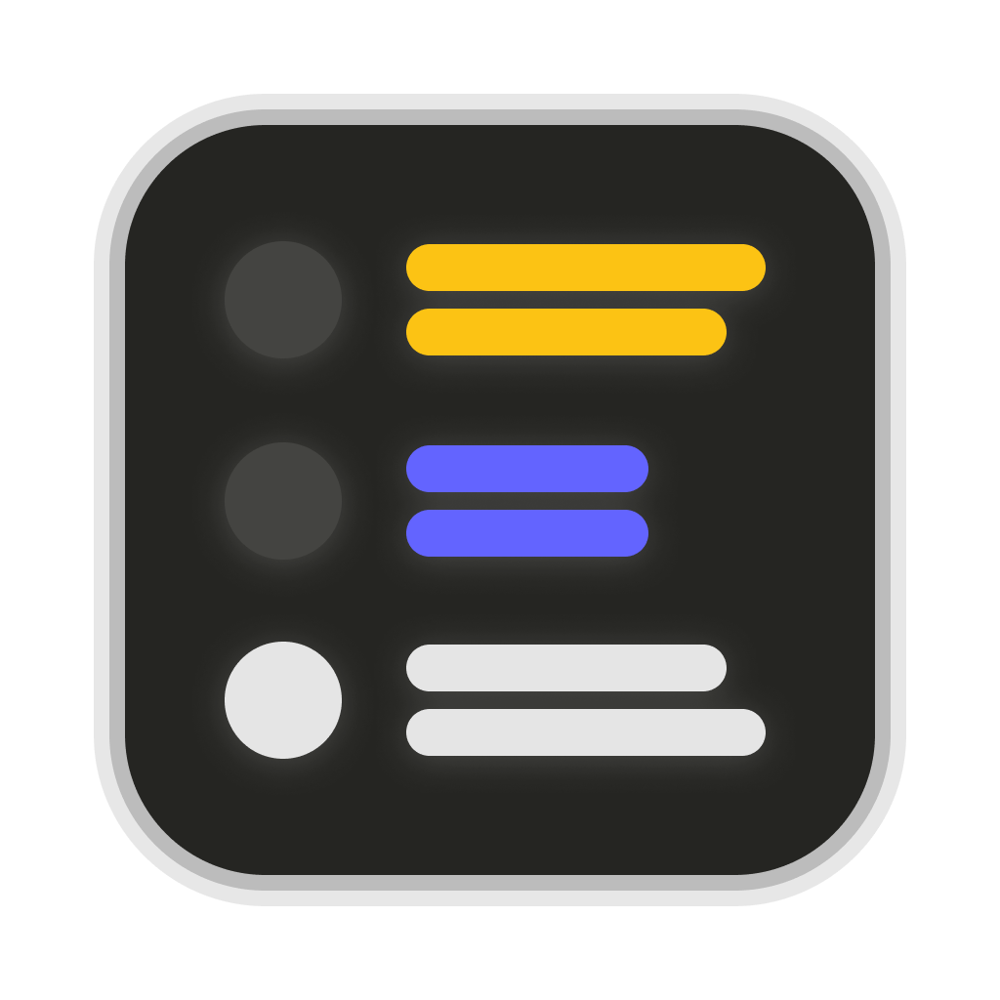

<div align="center">
  
  <h1>DotE - Daydream of the Elephants</h1>
  <p>「ながら見」に特化した透明ウィンドウ型Fediverseクライアント</p>
  
  <p>
    <a href="https://github.com/nekobato/DotE/releases/latest"></a>
    <a href="https://github.com/nekobato/DotE/blob/main/LICENSE"></a>
    <a href="https://github.com/nekobato/DotE/releases"></a>
  </p>
  
  <p>
    <a href="#features">機能</a> •
    <a href="#screenshots">スクリーンショット</a> •
    <a href="#installation">インストール</a> •
    <a href="#usage">使い方</a> •
    <a href="#development">開発</a> •
    <a href="#license">ライセンス</a>
  </p>
</div>

## ✨ DotEとは

DotEは「ながら見」のシチュエーションに特化したFediverseクライアントです。透明なウィンドウで他のアプリケーションを使いながらタイムラインを閲覧できます。コンパクトなデザインで多くの情報を一度に表示し、効率的なSNS体験を提供します。

### 対応プラットフォーム

<p>
  <a href="https://misskey-hub.net/"></a>
  <a href="https://joinmastodon.org/"></a>
  <a href="https://bluesky-web.com/"></a>
</p>

## 🚀 機能 <a name="features"></a>

### 🔍 ながら見モード

ウィンドウを透明にして、他のアプリケーションを使用しながらタイムラインを閲覧できます。作業中や動画視聴中でもSNSをチェックできる画期的な機能です。

### 📱 コンパクトなデザイン

表示スペースを最大限に活用したコンパクトなデザインにより、多くの投稿を一度に表示できます。情報密度が高く、効率的なSNS体験を提供します。

### 🔊 テキスト読み上げ

新しい投稿を自動的に読み上げる機能を搭載。視覚的な注意を払わなくても最新の投稿をキャッチできます。

### 🌐 マルチプラットフォーム対応

Misskey、Mastodon、Blueskyの主要なFediverseプラットフォームに対応。複数のアカウントを一つのアプリで管理できます。

## 📸 スクリーンショット <a name="screenshots"></a>

<div align="center">
  
  
  <p><em>左: 透明モードで他のアプリと共存 / 右: 通常モードでの表示</em></p>
</div>

## 💾 インストール <a name="installation"></a>

### macOS

最新バージョンをダウンロード：
[macOS用DotEをダウンロード](https://github.com/nekobato/DotE/releases/latest)

### Windows

近日対応予定です。開発状況は[GitHub Releases](https://github.com/nekobato/DotE/releases)でご確認ください。

## 📖 使い方 <a name="usage"></a>

### 基本操作

1. アプリを起動し、お好みのFediverseアカウントでログイン
2. 右上のモード切替ボタンで「通常モード」と「ながら見モード」を切り替え
3. 設定から透明度やテーマをカスタマイズ

### ショートカットキー

- `Cmd/Ctrl + H`: モード切替
- `Cmd/Ctrl + R`: タイムライン更新
- `Cmd/Ctrl + ,`: 設定画面を開く

## 🛠 開発 <a name="development"></a>

DotEはVue.js、Electron、TypeScriptで開発されています。

### 開発環境のセットアップ

```bash
# リポジトリのクローン
git clone https://github.com/nekobato/DotE.git
cd DotE

# 依存関係のインストール
pnpm install

# 開発サーバーの起動
pnpm dev
```

### ビルド

```bash
# アプリケーションのビルド
pnpm build
```

## 🔮 ロードマップ

- [ ] Windows版のリリース
- [ ] 投稿機能の強化
- [ ] カスタムテーマのサポート
- [ ] プラグイン機能

## 📄 ライセンス <a name="license"></a>

[MIT License](LICENSE)

---

<h2 id="english">English</h2>

# DotE - Daydream of the Elephants

A Fediverse client with a transparent window designed for "passive viewing" while using other applications.

## ✨ What is DotE?

DotE is a specialized Fediverse client designed for "passive viewing" scenarios. It features a transparent window that allows you to browse timelines while using other applications. With its compact design, it displays a large amount of information at once, providing an efficient social media experience.

### Supported Platforms

- [Misskey](https://misskey-hub.net/)
- [Mastodon](https://joinmastodon.org/)
- [Bluesky](https://bluesky-web.com/)

## 🚀 Features

- **Transparent Window Mode**: Browse timelines while using other applications
- **Compact Design**: View more posts at once with a space-efficient layout
- **Text-to-Speech**: Automatically read new posts aloud
- **Multi-Platform Support**: Connect to Misskey, Mastodon, and Bluesky accounts

## 💾 Installation

### macOS

Download the latest version:
[Download DotE for macOS](https://github.com/nekobato/DotE/releases/latest)

### Windows

Coming soon. Check [GitHub Releases](https://github.com/nekobato/DotE/releases) for updates.

## 📄 License

[MIT License](LICENSE)
