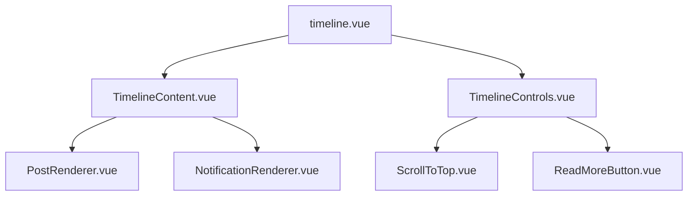

# Timeline.vue リファクタリング提案

## 概要

`src/pages/main/timeline.vue` は複数のSNSプラットフォーム（Misskey、Mastodon、Bluesky）のタイムラインを表示する重要なコンポーネントです。現在のコードは機能的には動作していますが、可読性、保守性、拡張性の観点から改善の余地があります。

## 現在の課題

- **単一責任原則の違反**: 1つのコンポーネントが多くの責任を持っている
- **複雑な条件分岐**: テンプレート内に多数のプラットフォーム固有の条件分岐
- **Import文の散在**: 27行にわたる整理されていないimport文
- **型安全性の不足**: 一部の型定義が不十分
- **スタイルの一貫性**: ハードコーディングされた値とクラス名の不統一

## 🏗️ 構造的な改善

### 1. コンポーネントの分割

現在のコンポーネントを以下のように分割することを提案します：



#### 分割後の責任

- **timeline.vue**: 全体の状態管理とレイアウト
- **TimelineContent.vue**: 投稿とコンテンツの表示ロジック
- **TimelineControls.vue**: スクロール制御とUI操作
- **PostRenderer.vue**: プラットフォーム別投稿レンダリング
- **NotificationRenderer.vue**: 通知表示の統一処理
- **ScrollToTop.vue**: トップへスクロール機能
- **ReadMoreButton.vue**: 続きを読む機能

### 2. プラットフォーム固有のロジックの抽象化

各プラットフォームの処理を統一的に扱うための抽象化レイヤーを作成：

```typescript
// composables/usePostRenderer.ts
interface PostRendererConfig {
  platform: "misskey" | "mastodon" | "bluesky";
  posts: any[];
  notifications?: any[];
  emojis?: any[];
  settings: {
    hideCw: boolean;
    showReactions: boolean;
    lineStyle: string;
  };
}

export const usePostRenderer = (config: PostRendererConfig) => {
  const renderComponent = computed(() => {
    switch (config.platform) {
      case "misskey":
        return config.notifications ? "MisskeyNotification" : "MisskeyNote";
      case "mastodon":
        return config.notifications ? "MastodonNotification" : "MastodonToot";
      case "bluesky":
        return "BlueskyPost";
      default:
        return null;
    }
  });

  return { renderComponent };
};
```

## 🧹 コードの整理

### 3. Import文の整理

現在の27行のimport文を機能別にグループ化：

```typescript
// Vue関連
import { computed, nextTick, reactive, ref, onMounted } from "vue";

// 外部ライブラリ
import { Icon } from "@iconify/vue";
import { AppBskyFeedDefs } from "@atproto/api";

// コンポーネント - 共通
import ErrorPost from "@/components/ErrorPost.vue";
import PostList from "@/components/PostList.vue";
import ReadMore from "@/components/Readmore.vue";
import TimelineHeader from "@/components/TimelineHeader.vue";
import DoteKiraKiraLoading from "@/components/common/DoteKirakiraLoading.vue";

// コンポーネント - プラットフォーム固有
import BlueskyPost from "@/components/BlueskyPost.vue";
import MastodonNotification from "@/components/MastodonNotification.vue";
import MastodonToot from "@/components/MastodonToot.vue";
import MisskeyNote from "@/components/MisskeyNote.vue";
import MisskeyNotification from "@/components/MisskeyNotification.vue";
import MisskeyAdCarousel from "@/components/misskey/MisskeyAdCarousel.vue";

// Store関連
import { useStore } from "@/store";
import { useTimelineStore } from "@/store/timeline";
import { useBlueskyStore } from "@/store/bluesky";
import { useMisskeyStore } from "@/store/misskey";
import { useMastodonStore } from "@/store/mastodon";

// 型定義
import type {
  MastodonNotification as MastodonNotificationType,
  MastodonToot as MastodonTootType,
} from "@/types/mastodon";
import { MisskeyEntities, type MisskeyNote as MisskeyNoteType } from "@shared/types/misskey";

// ユーティリティ
import { ipcSend } from "@/utils/ipc";
```

### 4. Computed プロパティの整理

関連するcomputed値をcomposableに移動：

```typescript
// composables/useTimelineState.ts
export const useTimelineState = () => {
  const store = useStore();
  const timelineStore = useTimelineStore();

  const hazeSettings = computed(() => ({
    opacity: (store.settings.mode === "haze" ? store.settings.opacity || 0 : 100) / 100,
    isEnabled: store.settings.mode === "haze",
  }));

  const scrollState = computed(() => ({
    canScrollToTop: store.settings.mode === "show" && scrollPosition.value > 0,
    canReadMore:
      (timelineStore.current?.posts.length && timelineStore.current?.posts.length > 0) ||
      (timelineStore.current?.notifications.length && timelineStore.current?.notifications.length > 0),
  }));

  const platformData = computed(() => ({
    emojis: timelineStore.currentInstance?.type === "misskey" ? timelineStore.currentInstance?.misskey?.emojis : [],
    ads:
      timelineStore.currentInstance?.type === "misskey" &&
      !hazeSettings.value.isEnabled &&
      timelineStore.currentInstance?.misskey?.meta.ads.length > 0 &&
      timelineStore.current?.posts.length
        ? timelineStore.currentInstance?.misskey?.meta.ads
        : [],
  }));

  return {
    hazeSettings,
    scrollState,
    platformData,
  };
};
```

## 🎯 機能的な改善

### 5. 条件分岐の簡素化

テンプレート内の複雑な条件分岐（146-210行目）を整理：

```vue
<!-- 改善前 -->
<MisskeyNote
  v-if="
    timelineStore.currentInstance?.type === 'misskey' &&
    timelineStore.current.channel !== 'misskey:notifications'
  "
  class="post-item"
  v-for="post in timelineStore.current.posts"
  :post="post as MisskeyNoteType"
  <!-- ... 多数のprops -->
/>

<!-- 改善後 -->
<PostRenderer
  :platform="timelineStore.currentInstance?.type"
  :channel="timelineStore.current.channel"
  :posts="timelineStore.current.posts"
  :notifications="timelineStore.current.notifications"
  :config="platformConfig"
  @reaction="handlePostAction('reaction', $event)"
  @newReaction="handlePostAction('newReaction', $event)"
  @repost="handlePostAction('repost', $event)"
/>
```

### 6. イベントハンドラーの統合

類似のイベントハンドラーを統合：

```typescript
// composables/usePostActions.ts
export const usePostActions = () => {
  const timelineStore = useTimelineStore();
  const misskeyStore = useMisskeyStore();
  const mastodonStore = useMastodonStore();
  const blueskyStore = useBlueskyStore();

  const handlePostAction = (action: string, payload: any) => {
    switch (action) {
      case "reaction":
        return ipcSend("main:reaction", {
          postId: payload.postId,
          reaction: payload.reaction,
        });

      case "newReaction":
        return ipcSend("post:reaction", {
          instanceUrl: timelineStore.currentInstance?.url,
          token: timelineStore.currentUser?.token,
          noteId: payload,
          emojis: timelineStore.currentInstance?.misskey?.emojis || [],
        });

      case "repost":
        return ipcSend("post:repost", payload);

      case "refreshPost":
        return misskeyStore.updatePost({ postId: payload });

      case "favourite":
        return mastodonStore.toggleFavourite(payload);

      case "like":
        return blueskyStore.like(payload);

      case "deleteLike":
        return blueskyStore.deleteLike(payload);

      default:
        console.warn(`Unknown post action: ${action}`);
    }
  };

  return { handlePostAction };
};
```

## 🔧 パフォーマンスの最適化

### 7. メモ化の活用

頻繁に計算される値のメモ化：

```typescript
const memoizedEmojis = computed(() => {
  return timelineStore.currentInstance?.type === "misskey" ? timelineStore.currentInstance?.misskey?.emojis : [];
});

const memoizedAds = computed(() => {
  if (timelineStore.currentInstance?.type !== "misskey" || isHazeMode.value) {
    return [];
  }

  const ads = timelineStore.currentInstance?.misskey?.meta.ads;
  const hasPosts = timelineStore.current?.posts.length > 0;

  return ads && ads.length > 0 && hasPosts ? ads : [];
});
```

### 8. 仮想スクロールの検討

大量の投稿を効率的に表示するための仮想スクロール実装を検討。特に長時間使用時のメモリ使用量削減に効果的。

```typescript
// composables/useVirtualScroll.ts
export const useVirtualScroll = (items: Ref<any[]>, itemHeight: number) => {
  const containerRef = ref<HTMLElement>();
  const scrollTop = ref(0);
  const containerHeight = ref(0);

  const visibleItems = computed(() => {
    const start = Math.floor(scrollTop.value / itemHeight);
    const end = Math.min(start + Math.ceil(containerHeight.value / itemHeight) + 1, items.value.length);

    return items.value.slice(start, end).map((item, index) => ({
      item,
      index: start + index,
      top: (start + index) * itemHeight,
    }));
  });

  return {
    containerRef,
    visibleItems,
    scrollTop,
    containerHeight,
  };
};
```

## 📝 型安全性の向上

### 9. 型定義の強化

より厳密な型定義：

```typescript
interface TimelineState {
  isAdding: boolean;
  isEmpty: boolean;
}

interface PostActionPayload {
  postId: string;
  reaction?: string;
  instanceUrl?: string;
  token?: string;
  noteId?: string;
  emojis?: any[];
}

interface PlatformConfig {
  hideCw: boolean;
  showReactions: boolean;
  lineStyle: string;
  currentInstanceUrl?: string;
}

type PostAction = "reaction" | "newReaction" | "repost" | "refreshPost" | "favourite" | "like" | "deleteLike";
```

### 10. プロップスの型安全性

コンポーネント間のデータ受け渡しの型安全性を向上：

```typescript
// PostRenderer.vue
interface Props {
  platform: "misskey" | "mastodon" | "bluesky";
  channel: string;
  posts: (MisskeyNoteType | MastodonTootType | AppBskyFeedDefs.FeedViewPost)[];
  notifications?: (MisskeyEntities.Notification | MastodonNotificationType)[];
  config: PlatformConfig;
}

const props = defineProps<Props>();
```

## 実装計画

### フェーズ1: 基盤整備

1. Composableの作成（`useTimelineState`, `usePostActions`）
2. 型定義の強化

### フェーズ2: コンポーネント分割

1. `PostRenderer.vue`の作成
2. `TimelineControls.vue`の作成
3. `ScrollToTop.vue`の作成

### フェーズ3: 統合とテスト

1. 既存コンポーネントの更新
2. 動作確認とテスト
3. パフォーマンス測定

### フェーズ4: 最適化

1. 仮想スクロールの実装（必要に応じて）
2. 追加の最適化
3. ドキュメント更新

## 期待される効果

- **可読性の向上**: コンポーネントの責任が明確になり、コードが理解しやすくなる
- **保守性の向上**: 変更時の影響範囲が限定され、バグの発生リスクが減少
- **拡張性の向上**: 新しいプラットフォームの追加が容易になる
- **パフォーマンスの向上**: メモ化と仮想スクロールによる最適化
- **型安全性の向上**: TypeScriptの恩恵を最大限活用

## 注意事項

- リファクタリングは段階的に実施し、各フェーズで動作確認を行う
- 既存の機能に影響を与えないよう、十分なテストを実施する
- ユーザー体験を損なわないよう、パフォーマンスの監視を継続する

このリファクタリングにより、`timeline.vue`はより保守しやすく、拡張しやすいコンポーネントに生まれ変わります。
